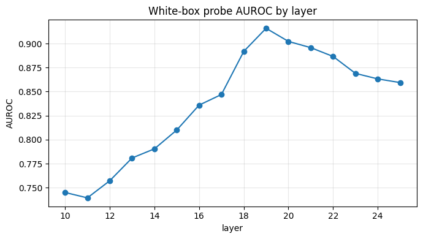

# trust-probe

A **real-time hallucination trust layer** for open LLMs that fuses **white-box** internal
activation probes with **black-box** reliability signals (self-consistency + faithfulness),
with a full evaluation harness. This is the research core that feeds
[`llm-firewall`](https://github.com/im-girisankar/llm-firewall) as a runtime guardrail, built
on the activation-probing approach from my M.Tech thesis
([`hallucination-detection-probing`](https://github.com/im-girisankar/hallucination-detection-probing)).

> **Why this is different:** most hallucination detectors are *either* white-box (internal states)
> *or* black-box (output consistency). trust-probe **fuses both** and detects mid-generation —
> the combination is under-explored and is the novelty.

## Status
- **CPU core (done):** datasets, eval harness (AUROC/AUPRC/ECE/bootstrap CIs), baselines,
  the sklearn `LogRegProbe`, black-box signals, and the `FusionClassifier` — all run and are
  tested **offline on synthetic data**. The headline demo is reproducible with no GPU.
- **GPU-gated (code present, not run in CI):** real activation extraction from Llama-3.1-8B
  (`activations.extract_activations`), the torch probe heads (`AttentionMLPProbe`,
  `TinyConvProbeAdapter`), and validation on **RAGTruth / HaluEval** for real AUROC numbers.

## The headline demo (offline, no GPU)
```bash
pip install -e ".[dev]"
trustprobe eval --synthetic
```
Trains the real white-box probe on synthetic activations, then fuses a deliberately-noisy
white-box score with a noisy black-box signal and shows the **fused detector beats either
alone** on AUROC, with a bootstrap CI — the core claim of the project, in miniature:

```
Detector                  AUROC
fusion (WB + BB)          0.911   <- wins
black-box signal (sim.)   0.858
white-box probe (sim.)    0.835
```

## Validated result (real, on GPU)

A linear probe on **Qwen2.5-7B-Instruct** layer-19 activations detects **TruthfulQA**
hallucinations (correct vs incorrect answers) at **AUROC 0.916 (95% CI [0.898, 0.931])**,
N = 1000. The signal localizes to the **mid-late layers** — AUROC climbs from 0.745 at layer 10
to a peak of **0.916 at layer 19**, then declines — reproducing the layer-localization finding
from the activation-probing thesis on a *different* model and a *public* benchmark, and
consistent with the "LLMs internally encode truthfulness" literature.



| Detector | AUROC | 95% CI |
|---|---|---|
| **white-box probe (layer 19)** | **0.916** | [0.898, 0.931] |
| fusion (WB + logprob) | 0.893 | [0.871, 0.913] |
| answer-logprob baseline | 0.460 | [0.425, 0.494] |

**Honest finding:** fusing the probe with the *logprob* baseline does **not** beat the probe —
the logprob signal is near-random (0.460), so it only adds noise. The white-box probe is the
result that stands. The validation script also evaluates a stronger black-box signal (**P(True)**
self-evaluation) and SelfCheckGPT-style consistency; for a probe already near the task ceiling,
fusion is expected to add little — fusion's value shows when *neither* signal alone is strong.

**Reproduce** (Kaggle/Colab GPU, ~10 min) — one cell:
```bash
!wget -q -O validate.py "https://raw.githubusercontent.com/im-girisankar/trust-probe/main/kaggle/validate_kaggle.py" && python validate.py
```
Or automatically: pushing to `kaggle/` runs it on a Kaggle GPU via GitHub Actions
(`.github/workflows/kaggle.yml`) and streams the leaderboard back into the Actions log.

## Layout
`datasets.py` (loaders + synthetic) · `activations.py` (GPU extraction + synthetic) ·
`probes.py` (LogReg + torch probe adapters) · `blackbox.py` (consistency + faithfulness) ·
`fusion.py` (meta-classifier) · `metrics.py` (AUROC/AUPRC/ECE/bootstrap) ·
`baselines.py` · `evaluate.py` (harness + leaderboard) · `cli.py`.

## License
MIT © 2026 Girisankar G
